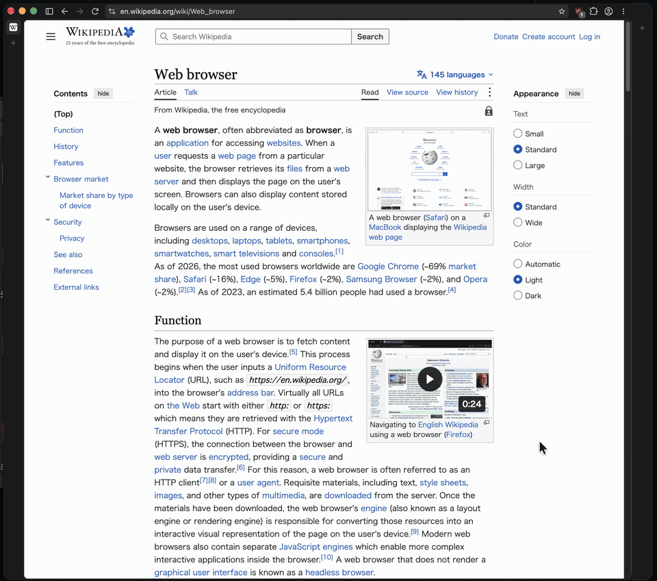

# Dual — Unofficial Helium derivative

Dual places two independent tab bars and browser panes in one window. Unlike a conventional Split View that places two tabs side by side, each side of Dual manages multiple tabs independently.

The same layout can be created by positioning two separate windows, but Dual integrates that workflow into one window. Dragging the divider resizes both panes together, so each window does not need to be positioned or resized separately.

## Download

[Download Dual-6.2.2-macOS-arm64.dmg](https://github.com/atemizu/Dual/releases/download/v6.2.2/Dual-6.2.2-macOS-arm64.dmg)

Open the DMG and copy Dual 6.2.2.app to Applications. This build is for Apple Silicon Macs. The distributed app is ad-hoc signed and is not signed or notarized with an Apple Developer ID.

### If macOS won't open the app

Because the app is not notarized, macOS blocks it the first time ("cannot be opened", "Apple could not verify…", or "is damaged").

1. Try to open Dual 6.2.2 once, then close the warning.
2. Open **System Settings → Privacy & Security**, scroll down, and click **Open Anyway** next to the message about Dual 6.2.2. Confirm with your password.

If the app is reported as damaged, or Open Anyway does not appear, remove the download quarantine flag in Terminal:

```sh
xattr -dr com.apple.quarantine "/Applications/Dual 6.2.2.app"
```

Dual 6.2.2 uses the same bundle identifier as Dual 5, so an existing Dual 5 profile carries over. Quit Dual 5 before opening Dual 6.2.2.

## What's new in 6.2.2

- Based on Helium 0.17.2.2 / Chromium 153.0.8010.52.
- Built with Helium's release configuration. Dual 5 was a development build with debug checks enabled, which made page scripts and layout several times slower.
- Smoother divider dragging (about 30% more updates per second without showing stale page content).
- No separate title bar: the window controls sit in the top-left pane, and the window can be moved from empty tab bar space.
- Rounded outer corners, equal side strips, optional Zen mode (show toolbars only on hover), and a new icon.
- Fixed: the pane could stay dimmed and stop responding after adding an extension.

Details: [MODIFICATIONS.md](MODIFICATIONS.md).

## Project status

The former development name was Helium Dual. Some legacy names remain in storage paths and internal identifiers for compatibility, and the app still shows Helium's name and logo in some places (for example its About page). Dual is an unofficial project and is not affiliated with imput LLC or the Helium project.

- Based on Helium 0.17.2.2 / Chromium 153.0.8010.52
- Target platform: macOS arm64 (Apple Silicon)
- Modified files: [MODIFICATIONS.md](MODIFICATIONS.md), [modifications.json](modifications.json)
- Build instructions: [BUILDING.md](BUILDING.md)
- Validation scope: [VALIDATION.md](VALIDATION.md)

## Helium services

Like Helium, Dual can use Helium's online services (for example, for extension downloads) when you enable them. Helium's privacy policy states that it does not apply to third-party or unofficial builds, so it does not cover Dual.

## Source and license

The canonical change set is [helium-dual-window.patch](helium-dual-window.patch), made against Helium 0.17.2.2 after Helium's own source preparation. The pinned upstream commits and hashes are recorded in [source-lock.json](source-lock.json).

The original code and modifications are released under the GNU General Public License version 3 (GPL-3.0-only). License text and third-party notices are included in [LICENSE](LICENSE), [licenses/](licenses/), and [NOTICE.md](NOTICE.md). The distributed app retains the upstream credits and license view at helium://credits/.

Dual is an unofficial modified version of Helium. It is not affiliated with, sponsored by, or endorsed by imput LLC or the Helium project. The modifications are released under GPL-3.0-only.
